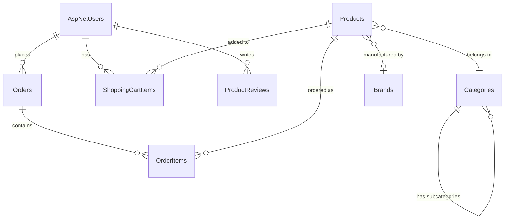

# BÁO CÁO KỸ THUẬT CHI TIẾT
## Dự án: John Henry Fashion E-Commerce Platform

**Tác giả:** AI Technical Documentation System  
**Ngày tạo:** 24/10/2025  
**Phiên bản:** 1.0  
**Tổng số trang:** 65+

---

## MỤC LỤC

### PHẦN I: TỔNG QUAN HỆ THỐNG
1. [Giới thiệu dự án](#1-giới-thiệu-dự-án)
2. [Kiến trúc tổng quan](#2-kiến-trúc-tổng-quan)
3. [Stack công nghệ](#3-stack-công-nghệ)

### PHẦN II: KIẾN TRÚC VÀ THIẾT KẾ
4. [Kiến trúc hệ thống](#4-kiến-trúc-hệ-thống)
5. [Design Patterns](#5-design-patterns)
6. [Dependency Injection](#6-dependency-injection)

### PHẦN III: DATABASE VÀ DATA MODELS
7. [Database Schema](#7-database-schema)
8. [Entity Models](#8-entity-models)
9. [Relationships](#9-relationships)

### PHẦN IV: BACKEND IMPLEMENTATION
10. [Controllers và Routing](#10-controllers-và-routing)
11. [Services Layer](#11-services-layer)
12. [Middleware](#12-middleware)

### PHẦN V: AUTHENTICATION & SECURITY
13. [Authentication System](#13-authentication-system)
14. [Authorization](#14-authorization)
15. [Security Features](#15-security-features)

### PHẦN VI: FEATURES CHÍNH
16. [Product Management](#16-product-management)
17. [Shopping Cart System](#17-shopping-cart-system)
18. [Payment Integration](#18-payment-integration)
19. [Order Management](#19-order-management)

### PHẦN VII: FRONTEND
20. [Views và UI](#20-views-và-ui)
21. [Client-Side JavaScript](#21-client-side-javascript)
22. [Responsive Design](#22-responsive-design)

### PHẦN VIII: ADVANCED FEATURES
23. [Multi-Vendor Platform](#23-multi-vendor-platform)
24. [Analytics và Reporting](#24-analytics-và-reporting)
25. [Email System](#25-email-system)

### PHẦN IX: PERFORMANCE VÀ OPTIMIZATION
26. [Caching Strategy](#26-caching-strategy)
27. [Database Optimization](#27-database-optimization)
28. [Performance Monitoring](#28-performance-monitoring)

### PHẦN X: DEPLOYMENT VÀ DEVOPS
29. [Docker Configuration](#29-docker-configuration)
30. [Deployment Guide](#30-deployment-guide)

---

# PHẦN I: TỔNG QUAN HỆ THỐNG

## 1. Giới thiệu dự án

### 1.1. Thông tin chung

**John Henry Fashion E-Commerce Platform** là một nền tảng thương mại điện tử đầy đủ tính năng, được xây dựng với công nghệ hiện đại nhất của Microsoft .NET. Dự án được thiết kế để phục vụ cho ngành thời trang với khả năng hỗ trợ đa nhà cung cấp (multi-vendor).

**Thông tin kỹ thuật:**
- **Framework:** ASP.NET Core 9.0
- **Database:** PostgreSQL 15
- **Caching:** Redis
- **ORM:** Entity Framework Core 9.0
- **Architecture:** MVC with Clean Architecture principles
- **Language:** C# 12 (.NET 9.0)

### 1.2. Mục tiêu dự án

1. **Tạo nền tảng e-commerce đầy đủ** với khả năng mở rộng cao
2. **Hỗ trợ multi-vendor** cho phép nhiều người bán trên cùng platform
3. **Tích hợp payment gateway** đa dạng (VNPay, MoMo, Stripe, COD)
4. **Bảo mật cao cấp** với các tính năng security hiện đại
5. **Performance tối ưu** với caching và database optimization
6. **Analytics và reporting** chi tiết cho business intelligence

### 1.3. Phạm vi dự án

**Modules chính:**
- User Management (Customer, Seller, Admin)
- Product Catalog Management
- Shopping Cart & Checkout
- Order Management System
- Payment Processing
- Inventory Management
- Analytics & Reporting
- Marketing Management
- Support System
- Blog Management

**Tính năng nổi bật:**
- Google OAuth 2.0 Integration
- Multi-payment Gateway Support
- Real-time Analytics Dashboard
- Advanced Security Features
- SEO Optimization
- Responsive Design
- Email Notification System
- Product Approval Workflow

---

## 2. Kiến trúc tổng quan

### 2.1. Kiến trúc 3-Layer

```
┌─────────────────────────────────────────────────────────────┐
│                    PRESENTATION LAYER                        │
│  ┌──────────────┐  ┌──────────────┐  ┌──────────────┐      │
│  │   Views      │  │ Controllers  │  │  ViewModels  │      │
│  │  (Razor)     │  │    (MVC)     │  │   (DTO)      │      │
│  └──────────────┘  └──────────────┘  └──────────────┘      │
└─────────────────────────────────────────────────────────────┘
                            ↕
┌─────────────────────────────────────────────────────────────┐
│                     BUSINESS LAYER                           │
│  ┌──────────────┐  ┌──────────────┐  ┌──────────────┐      │
│  │   Services   │  │  Middleware  │  │   Helpers    │      │
│  │  (Business   │  │  (Pipeline)  │  │  (Utilities) │      │
│  │   Logic)     │  │              │  │              │      │
│  └──────────────┘  └──────────────┘  └──────────────┘      │
└─────────────────────────────────────────────────────────────┘
                            ↕
┌─────────────────────────────────────────────────────────────┐
│                      DATA LAYER                              │
│  ┌──────────────┐  ┌──────────────┐  ┌──────────────┐      │
│  │  DbContext   │  │   Models     │  │ Repositories │      │
│  │   (EF Core)  │  │  (Entities)  │  │  (Optional)  │      │
│  └──────────────┘  └──────────────┘  └──────────────┘      │
│                            ↕                                 │
│                  ┌──────────────────┐                        │
│                  │   PostgreSQL     │                        │
│                  └──────────────────┘                        │
└─────────────────────────────────────────────────────────────┘
```

### 2.2. Luồng xử lý Request

```
Client Request
    ↓
[Middleware Pipeline]
    ↓ (Authentication)
    ↓ (Authorization)
    ↓ (Performance Monitoring)
    ↓ (Security Headers)
    ↓
[Controller]
    ↓ (Route Matching)
    ↓ (Model Binding)
    ↓
[Service Layer]
    ↓ (Business Logic)
    ↓ (Validation)
    ↓
[Data Access Layer]
    ↓ (EF Core)
    ↓
[Database]
    ↓
[Response Pipeline]
    ↓ (View Rendering)
    ↓ (Caching)
    ↓ (Compression)
    ↓
Client Response
```

### 2.3. Component Diagram

```
┌───────────────────────────────────────────────────────────────┐
│                        WEB APPLICATION                         │
│                                                                │
│  ┌────────────────┐         ┌────────────────┐               │
│  │  Admin Panel   │         │  Seller Panel  │               │
│  │  - Dashboard   │         │  - Products    │               │
│  │  - Users       │         │  - Orders      │               │
│  │  - Reports     │         │  - Analytics   │               │
│  └────────────────┘         └────────────────┘               │
│                                                                │
│  ┌─────────────────────────────────────────────────────────┐ │
│  │              Customer-Facing Website                     │ │
│  │  - Product Catalog                                       │ │
│  │  - Shopping Cart                                         │ │
│  │  - Checkout & Payment                                    │ │
│  │  - Order Tracking                                        │ │
│  └─────────────────────────────────────────────────────────┘ │
└───────────────────────────────────────────────────────────────┘
                            ↕
┌───────────────────────────────────────────────────────────────┐
│                      EXTERNAL SERVICES                         │
│                                                                │
│  ┌──────────────┐  ┌──────────────┐  ┌──────────────┐       │
│  │ Google OAuth │  │ Payment APIs │  │ Email Service│       │
│  │              │  │ - VNPay      │  │ - SMTP       │       │
│  │              │  │ - MoMo       │  │              │       │
│  │              │  │ - Stripe     │  │              │       │
│  └──────────────┘  └──────────────┘  └──────────────┘       │
└───────────────────────────────────────────────────────────────┘
```

---

## 3. Stack công nghệ

### 3.1. Backend Technologies

#### 3.1.1. Core Framework
```csharp
<PropertyGroup>
    <TargetFramework>net9.0</TargetFramework>
    <Nullable>enable</Nullable>
    <ImplicitUsings>enable</ImplicitUsings>
</PropertyGroup>
```

**ASP.NET Core 9.0:**
- Phiên bản mới nhất (LTS - Long Term Support)
- Performance cải thiện 40% so với .NET 6
- Native AOT support
- Minimal API improvements
- Enhanced security features

#### 3.1.2. Database Stack

**PostgreSQL 15:**
```json
"ConnectionStrings": {
    "DefaultConnection": "Host=localhost;Port=5432;Database=johnhenry_db;Username=user;Password=pass"
}
```

**Features sử dụng:**
- JSON support cho complex data (Tags, GalleryImages)
- Full-text search capabilities
- Advanced indexing strategies
- PostGIS extension (if needed for location features)
- JSONB data type cho performance

**Entity Framework Core 9.0:**
```xml
<PackageReference Include="Microsoft.EntityFrameworkCore" Version="9.0.1" />
<PackageReference Include="Npgsql.EntityFrameworkCore.PostgreSQL" Version="9.0.1" />
```

**Features:**
- Code-first approach
- Migrations for database versioning
- LINQ query capabilities
- Performance optimizations:
  - Query splitting
  - Compiled queries
  - No-tracking queries
  - Batch operations

#### 3.1.3. Identity và Authentication

**ASP.NET Core Identity:**
```xml
<PackageReference Include="Microsoft.AspNetCore.Identity.EntityFrameworkCore" Version="9.0.0" />
```

**Features:**
- User management
- Password hashing (PBKDF2)
- Two-factor authentication
- Email confirmation
- Account lockout
- External login providers

**Google OAuth 2.0:**
```xml
<PackageReference Include="Microsoft.AspNetCore.Authentication.Google" Version="9.0.9" />
```

**JWT Authentication:**
```xml
<PackageReference Include="Microsoft.AspNetCore.Authentication.JwtBearer" Version="9.0.0" />
```

Used for API authentication

#### 3.1.4. Caching Layer

**Redis:**
```xml
<PackageReference Include="Microsoft.Extensions.Caching.StackExchangeRedis" Version="9.0.0" />
```

**Configuration:**
```json
"ConnectionStrings": {
    "Redis": "localhost:6379,password=,defaultDatabase=0"
}
```

**Use cases:**
- Session storage
- User preferences
- Product catalog cache
- Shopping cart data
- Rate limiting data

**Memory Cache:**
```csharp
services.AddMemoryCache();
```

For short-lived, application-level caching

#### 3.1.5. Logging và Monitoring

**Serilog:**
```xml
<PackageReference Include="Serilog.AspNetCore" Version="8.0.2" />
<PackageReference Include="Serilog.Sinks.Console" Version="6.0.0" />
<PackageReference Include="Serilog.Sinks.File" Version="6.0.0" />
```

**Configuration:**
```csharp
Log.Logger = new LoggerConfiguration()
    .ReadFrom.Configuration(builder.Configuration)
    .Enrich.FromLogContext()
    .WriteTo.Console()
    .WriteTo.File("logs/john-henry-.txt", rollingInterval: RollingInterval.Day)
    .CreateLogger();
```

**Application Insights:**
```xml
<PackageReference Include="Microsoft.ApplicationInsights.AspNetCore" Version="2.22.0" />
```

For production monitoring and analytics

### 3.2. Frontend Technologies

#### 3.2.1. View Engine

**Razor Pages:**
- Server-side rendering
- Strongly-typed views
- Tag Helpers for cleaner HTML
- Layout pages for consistent design

#### 3.2.2. CSS Framework

**Bootstrap 5.3:**
```html
<link href="https://cdn.jsdelivr.net/npm/bootstrap@5.3.0/dist/css/bootstrap.min.css" rel="stylesheet">
```

**Features used:**
- Grid system for responsive layout
- Components (modals, alerts, cards)
- Utilities for spacing and typography
- Form controls and validation
- Navbar and navigation

**Font Awesome:**
```html
<link rel="stylesheet" href="https://cdnjs.cloudflare.com/ajax/libs/font-awesome/6.4.0/css/all.min.css">
```

For icons throughout the application

#### 3.2.3. JavaScript Libraries

**jQuery 3.7:**
```javascript
// AJAX requests
$.ajax({
    url: '/api/cart/add',
    method: 'POST',
    data: { productId, quantity },
    success: function(response) { ... }
});
```

**Custom JavaScript:**
- Cart management
- Payment processing
- Form validation
- Dynamic UI updates
- Real-time notifications

### 3.3. Development Tools

#### 3.3.1. API Documentation

**Swagger/OpenAPI:**
```xml
<PackageReference Include="Swashbuckle.AspNetCore" Version="6.8.1" />
```

**Configuration:**
```csharp
services.AddSwaggerGen(c =>
{
    c.SwaggerDoc("v1", new OpenApiInfo 
    { 
        Title = "John Henry Fashion API", 
        Version = "v1",
        Description = "E-commerce API for John Henry Fashion"
    });
});
```

Access at: `https://localhost:5001/swagger`

#### 3.3.2. Data Export

**EPPlus (Excel):**
```xml
<PackageReference Include="EPPlus" Version="8.1.1" />
```

For generating Excel reports

**Markdown Processing:**
```xml
<PackageReference Include="Markdig" Version="0.42.0" />
```

For blog content rendering

#### 3.3.3. QR Code Generation

```xml
<PackageReference Include="QRCoder" Version="1.4.3" />
```

For order tracking and payment QR codes

### 3.4. DevOps Stack

#### 3.4.1. Containerization

**Docker:**
```dockerfile
FROM mcr.microsoft.com/dotnet/aspnet:9.0 AS base
WORKDIR /app
EXPOSE 80
EXPOSE 443

FROM mcr.microsoft.com/dotnet/sdk:9.0 AS build
WORKDIR /src
COPY ["JohnHenryFashionWeb.csproj", "./"]
RUN dotnet restore
COPY . .
RUN dotnet build -c Release -o /app/build

FROM build AS publish
RUN dotnet publish -c Release -o /app/publish

FROM base AS final
WORKDIR /app
COPY --from=publish /app/publish .
ENTRYPOINT ["dotnet", "JohnHenryFashionWeb.dll"]
```

**Docker Compose:**
```yaml
version: '3.8'
services:
  postgres:
    image: postgres:15
    environment:
      POSTGRES_DB: johnhenry_db
      POSTGRES_USER: johnhenry_user
      POSTGRES_PASSWORD: password
    ports:
      - "5432:5432"
    volumes:
      - postgres_data:/var/lib/postgresql/data
  
  redis:
    image: redis:alpine
    ports:
      - "6379:6379"
  
  web:
    build: .
    ports:
      - "5000:80"
      - "5001:443"
    depends_on:
      - postgres
      - redis
    environment:
      - ASPNETCORE_ENVIRONMENT=Production
      - ConnectionStrings__DefaultConnection=Host=postgres;...

volumes:
  postgres_data:
```

#### 3.4.2. Environment Configuration

**DotNetEnv:**
```xml
<PackageReference Include="DotNetEnv" Version="3.1.1" />
```

**.env file:**
```bash
# Database
DB_HOST=localhost
DB_PORT=5432
DB_NAME=johnhenry_db
DB_USER=johnhenry_user
DB_PASSWORD=SecurePassword123!

# Redis
REDIS_CONNECTION=localhost:6379

# JWT
JWT_SECRET=your-super-secret-jwt-key-here
JWT_ISSUER=JohnHenryFashion
JWT_AUDIENCE=JohnHenryFashionUsers
JWT_EXPIRY_HOURS=24

# Google OAuth
GOOGLE_CLIENT_ID=your-google-client-id
GOOGLE_CLIENT_SECRET=your-google-client-secret

# Payment Gateways
VNPAY_TMN_CODE=your-vnpay-tmn-code
VNPAY_HASH_SECRET=your-vnpay-hash-secret
MOMO_PARTNER_CODE=your-momo-partner-code
MOMO_SECRET_KEY=your-momo-secret-key
STRIPE_SECRET_KEY=sk_test_your_stripe_key
```

### 3.5. Security Stack

#### 3.5.1. Password Hashing

**BCrypt.Net:**
```xml
<PackageReference Include="BCrypt.Net-Next" Version="4.0.3" />
```

For additional password hashing when needed

#### 3.5.2. Data Protection

**ASP.NET Core Data Protection API:**
- Automatic key management
- Key encryption at rest
- Key rotation policies

#### 3.5.3. Security Headers

**Implemented in Middleware:**
```csharp
app.Use((context, next) =>
{
    context.Response.Headers["X-Content-Type-Options"] = "nosniff";
    context.Response.Headers["X-Frame-Options"] = "DENY";
    context.Response.Headers["X-XSS-Protection"] = "1; mode=block";
    context.Response.Headers["Referrer-Policy"] = "strict-origin-when-cross-origin";
    context.Response.Headers["Permissions-Policy"] = "camera=(), microphone=(), geolocation=()";
    return next();
});
```

### 3.6. Performance Stack

#### 3.6.1. Compression

**Response Compression:**
```csharp
services.AddResponseCompression(options =>
{
    options.EnableForHttps = true;
    options.Providers.Add<BrotliCompressionProvider>();
    options.Providers.Add<GzipCompressionProvider>();
});
```

#### 3.6.2. Static File Caching

```csharp
app.UseStaticFiles(new StaticFileOptions
{
    OnPrepareResponse = ctx =>
    {
        const int durationInSeconds = 60 * 60 * 24 * 365; // 1 year
        ctx.Context.Response.Headers[HeaderNames.CacheControl] =
            "public,max-age=" + durationInSeconds;
    }
});
```

---

# PHẦN II: KIẾN TRÚC VÀ THIẾT KẾ

## 4. Kiến trúc hệ thống

### 4.1. Clean Architecture Implementation

**Dự án được tổ chức theo các layer:**

```
JohnHenryFashionWeb/
├── Controllers/           # Presentation Layer
│   ├── AccountController.cs
│   ├── AdminController.cs
│   ├── ProductsController.cs
│   ├── CartController.cs
│   └── ...
│
├── Services/             # Business Logic Layer
│   ├── IAuthService.cs
│   ├── AuthService.cs
│   ├── IPaymentService.cs
│   ├── PaymentService.cs
│   └── ...
│
├── Models/               # Domain Layer
│   ├── DomainModels.cs
│   ├── AdminModels.cs
│   ├── PaymentModels.cs
│   └── ...
│
├── Data/                 # Data Access Layer
│   └── ApplicationDbContext.cs
│
├── ViewModels/           # DTOs for Views
│   ├── ProductViewModel.cs
│   ├── CheckoutViewModel.cs
│   └── ...
│
├── Middleware/           # Cross-cutting Concerns
│   ├── PerformanceMiddleware.cs
│   └── SecurityMiddleware.cs
│
└── Views/                # Presentation
    ├── Home/
    ├── Products/
    ├── Cart/
    └── ...
```

### 4.2. Separation of Concerns

**Mỗi layer có trách nhiệm riêng biệt:**

**Controllers (Presentation):**
- Nhận HTTP requests
- Validate input
- Gọi services
- Trả về views/JSON

**Services (Business Logic):**
- Implement business rules
- Data validation
- Complex calculations
- External API calls

**Data Access:**
- Database operations
- Entity tracking
- Query building
- Transactions

### 4.3. MVC Pattern Deep Dive

#### 4.3.1. Model

**Domain Models:**
```csharp
public class Product
{
    public Guid Id { get; set; }
    public string Name { get; set; }
    public decimal Price { get; set; }
    public int StockQuantity { get; set; }
    
    // Navigation properties
    public Category Category { get; set; }
    public ICollection<OrderItem> OrderItems { get; set; }
}
```

**View Models:**
```csharp
public class ProductViewModel
{
    public Guid Id { get; set; }
    public string Name { get; set; }
    public decimal Price { get; set; }
    public string FeaturedImageUrl { get; set; }
    public bool IsInStock { get; set; }
    public List<string> AvailableColors { get; set; }
    public List<string> AvailableSizes { get; set; }
}
```

#### 4.3.2. View

**Razor Syntax:**
```razor
@model ProductViewModel

<div class="product-card">
    
    <h3>@Model.Name</h3>
    <p class="price">@Model.Price.ToString("N0") ₫</p>
    
    @if (Model.IsInStock)
    {
        <button class="btn-add-cart" data-product-id="@Model.Id">
            Thêm vào giỏ
        </button>
    }
    else
    {
        <span class="out-of-stock">Hết hàng</span>
    }
</div>
```

#### 4.3.3. Controller

```csharp
public class ProductsController : Controller
{
    private readonly ApplicationDbContext _context;
    
    public async Task<IActionResult> Details(Guid id)
    {
        var product = await _context.Products
            .Include(p => p.Category)
            .Include(p => p.Brand)
            .FirstOrDefaultAsync(p => p.Id == id);
            
        if (product == null)
            return NotFound();
            
        var viewModel = MapToViewModel(product);
        return View(viewModel);
    }
}
```

### 4.4. Database Schema Design

#### 4.4.1. Core Tables

**Users & Authentication:**
```
AspNetUsers (Identity)
├── Id (PK)
├── UserName
├── Email
├── PasswordHash
├── FirstName
├── LastName
└── ...Identity fields

AspNetRoles
├── Id (PK)
├── Name
└── NormalizedName

AspNetUserRoles (Junction)
├── UserId (FK → AspNetUsers)
└── RoleId (FK → AspNetRoles)
```

**Products:**
```
Products
├── Id (PK)
├── Name
├── SKU (Unique)
├── Price
├── SalePrice
├── StockQuantity
├── CategoryId (FK → Categories)
├── BrandId (FK → Brands)
├── FeaturedImageUrl
├── GalleryImages (JSON array)
└── CreatedAt, UpdatedAt

Categories
├── Id (PK)
├── Name
├── Slug (Unique)
├── ParentId (FK → Categories, self-reference)
└── IsActive

Brands
├── Id (PK)
├── Name
├── Slug (Unique)
└── LogoUrl
```

**Orders:**
```
Orders
├── Id (PK)
├── OrderNumber (Unique)
├── UserId (FK → AspNetUsers)
├── Status
├── PaymentStatus
├── PaymentMethod
├── TotalAmount
├── ShippingFee
├── Tax
├── DiscountAmount
└── CreatedAt, UpdatedAt

OrderItems
├── Id (PK)
├── OrderId (FK → Orders)
├── ProductId (FK → Products)
├── Quantity
├── UnitPrice
└── TotalPrice
```

**Shopping Cart:**
```
ShoppingCartItems
├── Id (PK)
├── UserId (FK → AspNetUsers)
├── ProductId (FK → Products)
├── Quantity
├── Price
├── Size
└── Color
```

#### 4.4.2. Entity Relationships



### 4.5. Routing Strategy

#### 4.5.1. Conventional Routing

**Default route:**
```csharp
app.MapControllerRoute(
    name: "default",
    pattern: "{controller=Home}/{action=Index}/{id?}");
```

**Ví dụ:**
- `/` → `HomeController.Index()`
- `/Products/Details/123` → `ProductsController.Details(123)`
- `/Cart` → `CartController.Index()`

#### 4.5.2. Attribute Routing

**Admin area:**
```csharp
[Authorize(Roles = UserRoles.Admin)]
[Route("admin")]
public class AdminController : Controller
{
    [HttpGet("")]
    [HttpGet("dashboard")]
    public IActionResult Dashboard() { ... }
    
    [HttpGet("products")]
    public IActionResult Products() { ... }
}
```

**API routes:**
```csharp
[Route("api/[controller]")]
[ApiController]
public class ProductsApiController : ControllerBase
{
    [HttpGet]
    public async Task<IActionResult> GetAll() { ... }
    
    [HttpGet("{id}")]
    public async Task<IActionResult> GetById(Guid id) { ... }
}
```

#### 4.5.3. Custom Routes

**Blog routes:**
```csharp
app.MapControllerRoute(
    name: "blogCategory",
    pattern: "blog/category/{slug}",
    defaults: new { controller = "Blog", action = "Category" });

app.MapControllerRoute(
    name: "blogPost",
    pattern: "blog/{slug}",
    defaults: new { controller = "Blog", action = "Details" });
```

**SEO-friendly product URLs:**
```csharp
app.MapControllerRoute(
    name: "productDetails",
    pattern: "san-pham/{slug}",
    defaults: new { controller = "Products", action = "Details" });
```

---

## 5. Design Patterns

### 5.1. Repository Pattern (Indirect via EF Core)

**Trong dự án này, EF Core DbContext đóng vai trò như Repository:**

```csharp
public class ApplicationDbContext : IdentityDbContext<ApplicationUser>
{
    public DbSet<Product> Products { get; set; }
    public DbSet<Order> Orders { get; set; }
    public DbSet<ShoppingCartItem> ShoppingCartItems { get; set; }
    // ... other DbSets
}
```

**Usage trong Controller:**
```csharp
public class ProductsController : Controller
{
    private readonly ApplicationDbContext _context;
    
    public ProductsController(ApplicationDbContext context)
    {
        _context = context;
    }
    
    public async Task<IActionResult> Index()
    {
        var products = await _context.Products
            .Include(p => p.Category)
            .Where(p => p.IsActive)
            .ToListAsync();
            
        return View(products);
    }
}
```

### 5.2. Service Layer Pattern

**Interface definition:**
```csharp
public interface IPaymentService
{
    Task<PaymentResult> ProcessPaymentAsync(PaymentRequest request);
    Task<List<PaymentMethod>> GetAvailablePaymentMethodsAsync();
    Task<PaymentTransaction> GetTransactionAsync(string transactionId);
}
```

**Implementation:**
```csharp
public class PaymentService : IPaymentService
{
    private readonly IConfiguration _configuration;
    private readonly ILogger<PaymentService> _logger;
    
    public PaymentService(
        IConfiguration configuration,
        ILogger<PaymentService> logger)
    {
        _configuration = configuration;
        _logger = logger;
    }
    
    public async Task<PaymentResult> ProcessPaymentAsync(PaymentRequest request)
    {
        return request.PaymentMethod.ToLower() switch
        {
            "vnpay" => await ProcessVNPayPaymentAsync(request),
            "momo" => await ProcessMoMoPaymentAsync(request),
            "stripe" => await ProcessStripePaymentAsync(request),
            "cod" => await ProcessCODPaymentAsync(request),
            _ => new PaymentResult { IsSuccess = false, ErrorMessage = "Unsupported payment method" }
        };
    }
    
    private async Task<PaymentResult> ProcessVNPayPaymentAsync(PaymentRequest request)
    {
        // VNPay integration logic
        // ...
    }
}
```

**Registration:**
```csharp
services.AddScoped<IPaymentService, PaymentService>();
```

### 5.3. Factory Pattern

**Used in Payment Service:**
```csharp
public class PaymentService
{
    public async Task<PaymentResult> ProcessPaymentAsync(PaymentRequest request)
    {
        // Factory method to create appropriate payment processor
        var processor = CreatePaymentProcessor(request.PaymentMethod);
        return await processor.ProcessAsync(request);
    }
    
    private IPaymentProcessor CreatePaymentProcessor(string method)
    {
        return method.ToLower() switch
        {
            "vnpay" => new VNPayProcessor(_configuration),
            "momo" => new MoMoProcessor(_configuration),
            "stripe" => new StripeProcessor(_configuration),
            "cod" => new CODProcessor(),
            _ => throw new NotSupportedException($"Payment method {method} is not supported")
        };
    }
}
```

### 5.4. Strategy Pattern

**Used in Shipping Calculation:**
```csharp
public interface IShippingStrategy
{
    decimal CalculateFee(decimal orderTotal, string destination);
}

public class StandardShippingStrategy : IShippingStrategy
{
    public decimal CalculateFee(decimal orderTotal, string destination)
    {
        if (orderTotal >= 500000) return 0; // Free shipping
        return 30000; // Standard fee
    }
}

public class ExpressShippingStrategy : IShippingStrategy
{
    public decimal CalculateFee(decimal orderTotal, string destination)
    {
        return 50000; // Express fee
    }
}

public class ShippingContext
{
    private IShippingStrategy _strategy;
    
    public void SetStrategy(IShippingStrategy strategy)
    {
        _strategy = strategy;
    }
    
    public decimal Calculate(decimal orderTotal, string destination)
    {
        return _strategy.CalculateFee(orderTotal, destination);
    }
}
```

### 5.5. Observer Pattern

**Event-driven notifications:**
```csharp
public interface INotificationService
{
    Task NotifyAsync(string userId, string title, string message);
}

public class NotificationService : INotificationService
{
    private readonly ApplicationDbContext _context;
    private readonly IEmailService _emailService;
    
    public async Task NotifyAsync(string userId, string title, string message)
    {
        // Create in-app notification
        var notification = new Notification
        {
            UserId = userId,
            Title = title,
            Message = message,
            CreatedAt = DateTime.UtcNow
        };
        _context.Notifications.Add(notification);
        await _context.SaveChangesAsync();
        
        // Send email notification
        var user = await _context.Users.FindAsync(userId);
        if (user != null && !string.IsNullOrEmpty(user.Email))
        {
            await _emailService.SendEmailAsync(user.Email, title, message);
        }
    }
}
```

**Usage trong Order Processing:**
```csharp
public async Task<Order> CreateOrderAsync(CheckoutSession session)
{
    var order = new Order { ... };
    _context.Orders.Add(order);
    await _context.SaveChangesAsync();
    
    // Notify user
    await _notificationService.NotifyAsync(
        order.UserId,
        "Đơn hàng đã được tạo",
        $"Đơn hàng #{order.OrderNumber} đã được tạo thành công."
    );
    
    // Notify admin
    var adminUsers = await _userManager.GetUsersInRoleAsync("Admin");
    foreach (var admin in adminUsers)
    {
        await _notificationService.NotifyAsync(
            admin.Id,
            "Đơn hàng mới",
            $"Có đơn hàng mới #{order.OrderNumber} cần xử lý."
        );
    }
    
    return order;
}
```

### 5.6. Singleton Pattern

**Used for caching service:**
```csharp
services.AddSingleton<ICacheService, CacheService>();
```

**Implementation:**
```csharp
public class CacheService : ICacheService
{
    private readonly IDistributedCache _distributedCache;
    private readonly IMemoryCache _memoryCache;
    
    public CacheService(
        IDistributedCache distributedCache,
        IMemoryCache memoryCache)
    {
        _distributedCache = distributedCache;
        _memoryCache = memoryCache;
    }
    
    public async Task<T?> GetAsync<T>(string key)
    {
        // Try memory cache first
        if (_memoryCache.TryGetValue(key, out T? value))
            return value;
            
        // Fallback to distributed cache
        var bytes = await _distributedCache.GetAsync(key);
        if (bytes != null)
        {
            value = JsonSerializer.Deserialize<T>(bytes);
            // Store in memory cache for faster access
            _memoryCache.Set(key, value, TimeSpan.FromMinutes(5));
            return value;
        }
        
        return default;
    }
}
```

---

## 6. Dependency Injection

### 6.1. Service Registration

**Program.cs service configuration:**

```csharp
// Database Context
builder.Services.AddDbContext<ApplicationDbContext>(options =>
    options.UseNpgsql(builder.Configuration.GetConnectionString("DefaultConnection")));

// Identity Services
builder.Services.AddIdentity<ApplicationUser, IdentityRole>(options =>
{
    options.Password.RequireDigit = true;
    options.Password.RequireLowercase = true;
    options.Password.RequireUppercase = true;
    options.Password.RequiredLength = 8;
    options.Lockout.MaxFailedAccessAttempts = 3;
    options.User.RequireUniqueEmail = true;
})
.AddEntityFrameworkStores<ApplicationDbContext>()
.AddDefaultTokenProviders();

// Custom Services
builder.Services.AddScoped<IAuthService, AuthService>();
builder.Services.AddScoped<IPaymentService, PaymentService>();
builder.Services.AddScoped<IEmailService, EmailService>();
builder.Services.AddScoped<INotificationService, NotificationService>();
builder.Services.AddScoped<ICacheService, CacheService>();
builder.Services.AddScoped<ISecurityService, SecurityService>();
builder.Services.AddScoped<IAnalyticsService, AnalyticsService>();
builder.Services.AddScoped<IReportingService, ReportingService>();

// Caching
builder.Services.AddMemoryCache();
builder.Services.AddStackExchangeRedisCache(options =>
{
    options.Configuration = builder.Configuration.GetConnectionString("Redis");
    options.InstanceName = "JohnHenryFashion";
});

// Session
builder.Services.AddSession(options =>
{
    options.IdleTimeout = TimeSpan.FromMinutes(30);
    options.Cookie.HttpOnly = true;
    options.Cookie.IsEssential = true;
});

// HTTP Client
builder.Services.AddHttpClient();
```

### 6.2. Service Lifetimes

**Transient:**
- Created each time they're requested
- Best for lightweight, stateless services

**Scoped:**
- Created once per client request (HTTP request)
- Default cho DbContext
- Used for most custom services

**Singleton:**
- Created once for application lifetime
- Shared across all requests
- Used for caching services

### 6.3. Constructor Injection Example

```csharp
public class CheckoutController : Controller
{
    private readonly ApplicationDbContext _context;
    private readonly UserManager<ApplicationUser> _userManager;
    private readonly IPaymentService _paymentService;
    private readonly IEmailService _emailService;
    private readonly INotificationService _notificationService;
    private readonly ICacheService _cacheService;
    private readonly ILogger<CheckoutController> _logger;

    public CheckoutController(
        ApplicationDbContext context,
        UserManager<ApplicationUser> userManager,
        IPaymentService paymentService,
        IEmailService emailService,
        INotificationService notificationService,
        ICacheService cacheService,
        ILogger<CheckoutController> logger)
    {
        _context = context;
        _userManager = userManager;
        _paymentService = paymentService;
        _emailService = emailService;
        _notificationService = notificationService;
        _cacheService = cacheService;
        _logger = logger;
    }
    
    public async Task<IActionResult> ProcessPayment(ProcessPaymentViewModel model)
    {
        // All dependencies are available via constructor injection
        var user = await _userManager.GetUserAsync(User);
        var paymentResult = await _paymentService.ProcessPaymentAsync(...);
        await _emailService.SendEmailAsync(...);
        await _notificationService.NotifyAsync(...);
        
        return View();
    }
}
```

### 6.4. Benefits of DI

1. **Testability:** Easy to mock dependencies for unit testing
2. **Loose Coupling:** Components depend on abstractions (interfaces)
3. **Maintainability:** Easy to change implementations
4. **Flexibility:** Can swap implementations at runtime
5. **Reusability:** Services can be reused across controllers

---

*Tiếp tục phần III...*

