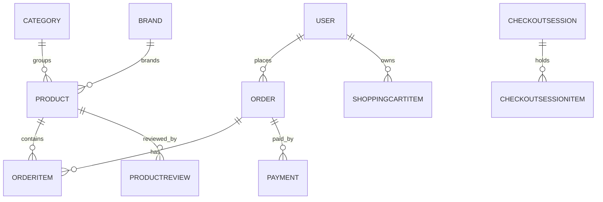
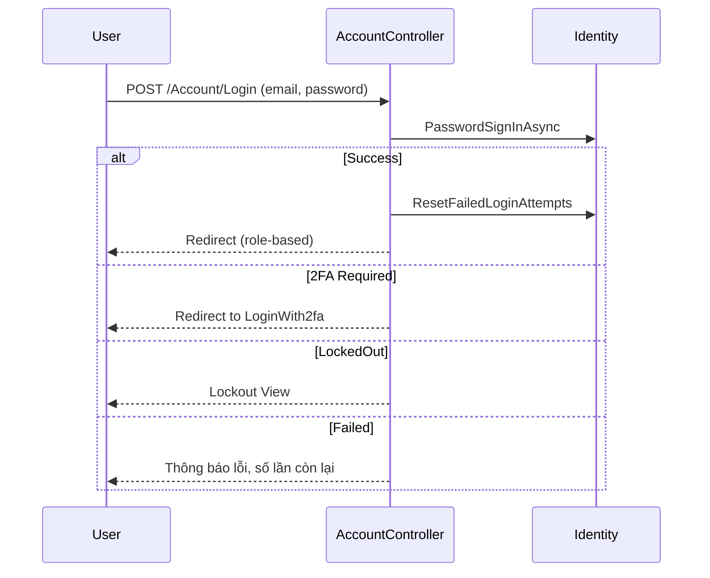
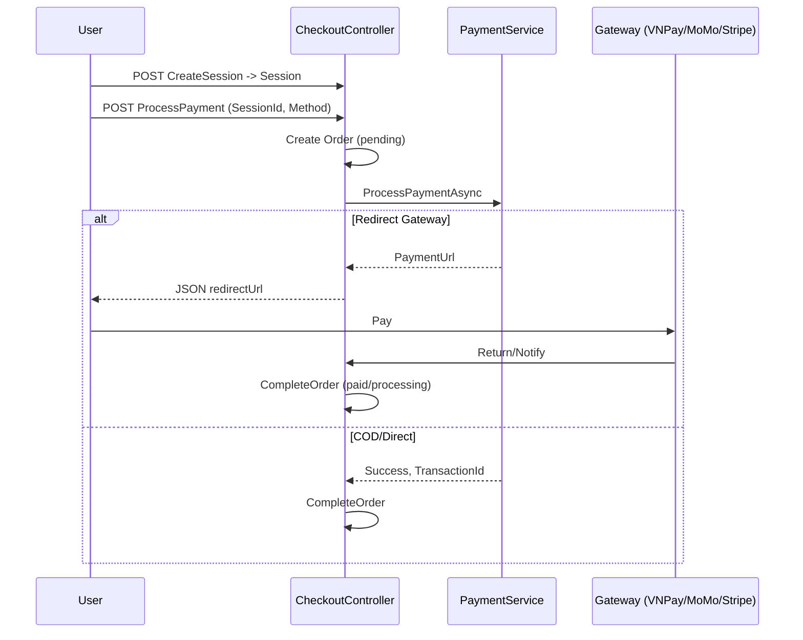

# Báo cáo Kiến trúc & Tính năng ứng dụng John Henry Fashion Web

Phiên bản: 2025-10-24

Tài liệu này mô tả toàn diện kiến trúc, công nghệ, routing, cơ sở dữ liệu, cơ chế đăng nhập/xác thực, và các tính năng cơ bản/nâng cao của hệ thống thương mại điện tử John Henry Fashion Web.

Lưu ý: Tài liệu được viết dựa trên mã nguồn hiện tại trong branch `main`. Một số số liệu có thể là ước lượng nếu chưa có dữ liệu vận hành thực tế. Các sơ đồ sử dụng ngôn ngữ Mermaid để dễ dàng chuyển đổi sang tài liệu Word/PDF.

---

## 1. Tổng quan hệ thống

- Kiểu ứng dụng: ASP.NET Core MVC (TargetFramework: .NET 9.0)
- Kiến trúc: MVC + Services + EF Core + Identity + Middleware tùy biến
- CSDL: PostgreSQL (Npgsql), cache phân tán Redis, cache trong bộ nhớ
- Xác thực: ASP.NET Core Identity, Cookie Auth, JWT (cho API), Google OAuth
- Logging & Telemetry: Serilog (console + rolling file), Application Insights
- Tối ưu phản hồi: Response Caching, Response Compression (Gzip/Brotli), Static files cache-control 1 năm
- Bảo mật: Chính sách mật khẩu, khóa tài khoản khi đăng nhập sai, session secure policies, security headers (prod), 2FA
- Triển khai: Dockerfile sẵn sàng build/publish; docker-compose cho Postgres + pgAdmin
- Tích hợp thanh toán: VNPay, MoMo, Stripe, COD, Chuyển khoản ngân hàng
- Các module chức năng chính: Sản phẩm, Giỏ hàng, Thanh toán/Đơn hàng, Khuyến mãi, Blog, Đánh giá, Quản trị, Người bán (Seller), Phân tích & Báo cáo, Hỗ trợ, Cấu hình hệ thống

Các tệp trọng yếu:
- `Program.cs`: cấu hình dịch vụ, middleware, routing, seed dữ liệu, policies
- `JohnHenryFashionWeb.csproj`: tham chiếu package (EF Core, Identity, Serilog, Redis, Swagger, v.v.)
- `appsettings.json`: thông số mặc định; giá trị động override bằng biến môi trường từ `.env`
- `Data/ApplicationDbContext.cs`: DbContext + cấu hình entity bằng Fluent API + seed
- `Controllers/*`: điều khiển luồng người dùng (Home, Products, Cart, Checkout, Payment, Account, Admin*, Seller*)
- `Services/*`: cache/email/security/analytics/reporting/payment...
- `Dockerfile`, `docker-compose.yml`: hỗ trợ triển khai container

---

## 2. Ngăn xếp công nghệ chi tiết

- Backend: ASP.NET Core 9 + MVC + API Explorer/Swagger
- ORM: Entity Framework Core 9 (Npgsql provider)
- Identity: Microsoft.AspNetCore.Identity
- Auth:
  - Cookie (web) với các thiết lập SameSite/HttpOnly/Expire/Sliding
  - JWT Bearer (cho API) với ValidateIssuer/Audience/SigningKey
  - Google OAuth (SignInScheme = External)
- Caching: MemoryCache + StackExchange.Redis
- Session: ASP.NET Core Session (IdleTimeout 30 phút)
- Observability: Serilog, ApplicationInsights
- Hiệu năng: ResponseCaching, ResponseCompression (Brotli/Gzip), cache headers static files, PerformanceMiddleware
- E-mail: `EmailService` (SMTP cấu hình từ biến môi trường)
- Thanh toán: `PaymentService` (cấu hình VNPay/MoMo/Stripe/COD/Bank)
- SEO/Tối ưu ảnh: `SeoService`, `ImageOptimizationService`
- Phân tích/Báo cáo: `AnalyticsService`, `ReportingService`
- Docker: .NET SDK build stage + aspnet runtime stage

---

## 3. Routing & Middleware

### 3.1 Middleware pipeline (từ `Program.cs`)

1. UseSwagger + DevExceptionPage (môi trường Development)
2. ExceptionHandler + HSTS + security headers (Production)
3. ResponseCompression
4. Custom `PerformanceMiddleware`
5. ResponseCaching
6. HTTPS Redirection
7. StaticFiles với Cache-Control dài hạn
8. Routing
9. Session
10. Authentication -> Authorization
11. Map static assets, MapControllerRoute (blog, default, api)

### 3.2 Định tuyến chính

- Blog:
  - `blog/category/{slug}` -> `BlogController.Category`
  - `blog/{slug}` -> `BlogController.Details`
- Mặc định:
  - `{controller=Home}/{action=Index}/{id?}`
- API convention:
  - `api/{controller}/{action=Index}/{id?}`

### 3.3 Sơ đồ routing (khái quát)

```mermaid
flowchart LR
  A[Home/Index] --> B[Products/ProductDetail]
  B --> C[Cart/Index]
  C -->|Chọn sản phẩm| D[Checkout/Index]
  D -->|CreateSession| E[Checkout/Payment]
  E -->|ProcessPayment| F{Gateway}
  F -->|VNPay/MoMo/Stripe| G[Checkout/Success]
  F -->|Fail| H[Checkout/Failed]
  subgraph Blog
    BA[Blog/Category/{slug}] --> BB[Blog/{slug}]
  end
  subgraph Auth
    AA[Account/Login] --> AB[Account/Register]
    AB --> AC[Email Verification]
    AA --> AD[2FA]
  end
  subgraph Admin
    A1[Admin/Dashboard]
    A2[Admin/Inventory]
    A3[Admin/Users]
    A4[Admin/Reports]
  end
```

---

## 4. Mô hình dữ liệu và quan hệ

DbContext: `ApplicationDbContext` kế thừa `IdentityDbContext<ApplicationUser>`; bao phủ domain TMĐT đầy đủ: Sản phẩm, Danh mục, Thương hiệu, Cửa hàng, Đơn hàng, Mục đơn hàng, Giỏ hàng, Ảnh sản phẩm, Đánh giá, Coupon, Tồn kho, Địa chỉ, Thanh toán, Blog, Liên hệ, Thông báo, Log bảo mật, 2FA, Phương thức/phiên thanh toán, Refund, Phí nền tảng, Cấu hình hệ thống, Ticket hỗ trợ, Marketing, Báo cáo, v.v.

Một số thực thể tiêu biểu:
- Product, Category (có self-reference Parent), Brand
- Order, OrderItem, OrderStatusHistory
- ShoppingCartItem, Wishlist
- Payment, PaymentAttempt, PaymentTransaction, RefundRequest
- CheckoutSession, CheckoutSessionItem
- ShippingMethod, ShippingConfiguration
- Promotion, Coupon, CouponUsage, SystemPromotion
- BlogPost, BlogCategory
- Notification, SecurityLog, PasswordHistory, ActiveSession, TwoFactorToken
- InventoryItem, StockMovement
- SellerSettlement, WithdrawalRequest
- SystemConfiguration, EmailConfiguration, TaxConfiguration, RolePermission, PlatformFeeConfiguration

Các ràng buộc, chỉ mục, kiểu dữ liệu decimal(10,2) hoặc (18,2) cho giá trị tiền tệ được cấu hình chi tiết bằng Fluent API; nhiều chỉ mục tối ưu hóa truy vấn (Slug unique, SKU unique, OrderNumber unique, IsActive, CreatedAt...).

Sơ đồ thực thể khái quát:



---

## 5. Đăng nhập, xác thực, phân quyền

- ASP.NET Core Identity với `ApplicationUser` (FirstName/LastName/IsActive/IsApproved/LastLoginDate...)
- Vai trò: `Admin`, `Seller`, `Customer` (seed tại startup). Chính sách: RequireAdminRole, RequireSellerRole, RequireAdminOrSellerRole
- Cookie Auth (Application + External), cấu hình đơn giản hóa cho dev, session trước auth
- Đăng nhập bằng email+password, hỗ trợ 2FA, khóa tài khoản sau nhiều lần sai; ghi nhận ActiveSessions, SecurityLogs, PasswordHistories
- Đăng ký có thể bật xác thực email bằng mã 6 số (cache Redis)
- Google OAuth: ExternalScheme; email auto-confirm
- Định tuyến sau đăng nhập: Admin -> Admin/Dashboard; Seller -> Seller/Dashboard; Customer -> về returnUrl nếu hợp lệ hoặc Home

Trình tự đăng nhập chuẩn (mermaid):



---

## 6. Luồng mua hàng: Giỏ hàng, Checkout, Thanh toán, Hoàn tất

### 6.1 Giỏ hàng (`CartController`)
- Chỉ dành cho user đã đăng nhập (Authorize)
- Tính tổng giá, số lượng; cập nhật số lượng; xóa sản phẩm; lưu danh sách chọn để thanh toán; render sidebar cart
- Kiểm tra tồn kho khi cập nhật/thêm hàng

### 6.2 Trang sản phẩm & Buy Now (`ProductsController`)
- `ProductDetail(id)`: hiển thị, tăng viewCount, gợi ý sản phẩm liên quan cùng danh mục
- `BuyNow`: lưu item tạm (TempData) và chuyển hướng `Checkout?mode=buynow`

### 6.3 Checkout (`CheckoutController`)
- Với user ẩn danh: lấy giỏ từ session; với user đăng nhập: lấy từ DB, hoặc danh sách đã chọn
- Tạo `CheckoutSession` + `CheckoutSessionItem`
- Tính Subtotal, ShippingFee, VAT 10%, Discount (Promotion/ Coupon), Total
- Chọn phương thức thanh toán và giao hàng
- `ProcessPayment`: tạo Order trước, cập nhật session, gọi `PaymentService.ProcessPaymentAsync` để điều phối đến gateway (trả về URL redirect hoặc xử lý trực tiếp cho COD)
- Xử lý return/notify (VNPay), cập nhật trạng thái đơn, gửi email, notification, trừ tồn kho, thêm lịch sử trạng thái

### 6.4 Thanh toán (`PaymentController` – legacy/demo)
- Có flow tính phí ship/thuế/giảm giá tương tự; có phương thức giả lập redirect VNPay/MoMo

Sơ đồ trình tự thanh toán (tối giản):



---

## 7. Tính năng cơ bản và nâng cao

### 7.1 Cửa hàng & sản phẩm
- Danh mục, thương hiệu, chi tiết sản phẩm, hình ảnh nổi bật, gallery, SKU, Price/SalePrice, tồn kho, nổi bật, lọc cơ bản theo danh mục
- Review sản phẩm, duyệt review (Admin)

### 7.2 Giỏ hàng & Wishlist
- Thêm/xóa/cập nhật; tính tổng; lưu lựa chọn; hỗ trợ “Buy Now”

### 7.3 Đơn hàng & vận chuyển
- Tạo đơn từ phiên checkout; lịch sử trạng thái; phương thức vận chuyển cấu hình qua `ShippingMethod`; seed mặc định

### 7.4 Khuyến mãi & Coupon
- Promotion theo phần trăm/định lượng; min order; max discount; usage limit; thời gian hiệu lực

### 7.5 Blog & Nội dung
- Blog Category, Blog Post, slug unique, gợi ý bài viết, seed mẫu

### 7.6 Tài khoản & Bảo mật
- Hồ sơ, địa chỉ, thay đổi mật khẩu, đặt mật khẩu, 2FA, quản lý phiên hoạt động, log bảo mật, xác thực email bằng code, Google OAuth

### 7.7 Quản trị (Admin)
- Bảng điều khiển (doanh thu, đơn, người dùng, cảnh báo)
- Quản lý người dùng (lọc, phân trang, vai trò, trạng thái, reset mật khẩu)
- Quản lý tồn kho, danh mục, thương hiệu, review, coupon
- Báo cáo, analytics, xuất Excel/PDF (template có sẵn)

### 7.8 Người bán (Seller)
- Vai trò Seller; có dashboard riêng (controller riêng `SellerController`); quy trình phê duyệt sản phẩm (ProductApproval) ở mức dữ liệu

### 7.9 Hỗ trợ & Khiếu nại
- Ticket hỗ trợ, trả lời, Dispute, phân loại/mức độ ưu tiên

### 7.10 Hệ thống & Marketing
- Cấu hình thuế/ship/email/gateway; phí nền tảng; banner/flash sale; campaign email/push

---

## 8. Bảo mật & Hiệu năng

- Bảo mật: chính sách mật khẩu nâng cao; lockout sau 3 lần; RequireConfirmedEmail (tùy biến env); 2FA; security headers (prod); SameSite/HttpOnly Cookie; HTTPS bắt buộc; JWT cho API
- Nhật ký: Serilog file rolling theo ngày, console; SecurityLog entity
- Hiệu năng: Redis cache, response caching, compression, static cache, PerformanceMiddleware đo đạc

---

## 9. Triển khai & Môi trường

### 9.1 Docker
- Multi-stage build: `dotnet restore`, `build`, `publish`, runtime aspnet 9.0

### 9.2 docker-compose
- Postgres 15 + PGAdmin; volume dữ liệu; cổng 5432/8080

### 9.3 Cấu hình môi trường (.env)
- DB_HOST/PORT/NAME/USER/PASSWORD, REDIS_CONNECTION
- JWT_*, GOOGLE_CLIENT_*
- EMAIL_*, BASE_URL, SITE_NAME, v.v.
- PaymentGateways: VNPAY/MOMO/STRIPE… flags IsEnabled/IsSandbox

---

## 10. Swagger & API

- Đã bật `AddEndpointsApiExplorer` + `AddSwaggerGen` và `UseSwagger/UI` trong Development.
- Route API theo convention `api/{controller}/{action}/{id?}`.

---

## 11. Đề xuất cải tiến (ngắn hạn)

- Bổ sung unit/integration tests tối thiểu (đơn hàng, checkout, coupon)
- Bảo vệ webhook PaymentNotify theo secret + verify chữ ký
- Rate limiting cho endpoint nhạy cảm (login, payment)
- Hoàn chỉnh PaymentService tích hợp thực VNPay/MoMo/Stripe (hàm mẫu hiện có)
- Sơ đồ ER chi tiết hơn (tạo bằng tool từ migration) đính kèm trong phụ lục
- Phân trang/tìm kiếm nâng cao cho catalog + cache layer cho danh mục/sản phẩm

---

## 12. Phụ lục: Danh sách gói NuGet chính

- Microsoft.EntityFrameworkCore.* 9.0.1
- Npgsql.EntityFrameworkCore.PostgreSQL 9.0.1
- Microsoft.AspNetCore.Identity.EntityFrameworkCore 9.0.0
- Microsoft.AspNetCore.Authentication.JwtBearer 9.0.0
- Microsoft.AspNetCore.Authentication.Google 9.0.9
- Microsoft.Extensions.Caching.StackExchangeRedis 9.0.0
- Serilog.AspNetCore 8.0.2 (+ console/file sinks)
- Swashbuckle.AspNetCore 6.8.1
- EPPlus, Markdig, QRCoder, DotNetEnv

---

Tài liệu này có thể được chuyển đổi sang Word/PDF. Khi xuất sang Word, mỗi phần/tiểu mục có thể mở rộng thêm hình ảnh, bảng, và số liệu để đạt độ dài trang mong muốn.
