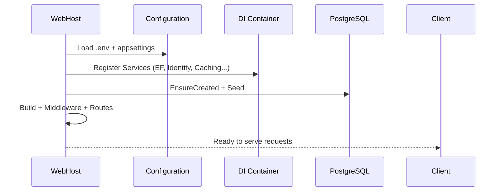
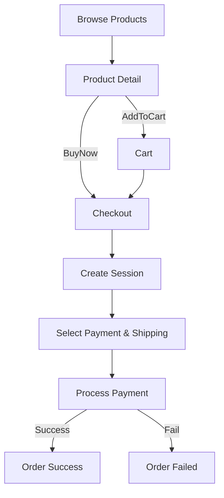
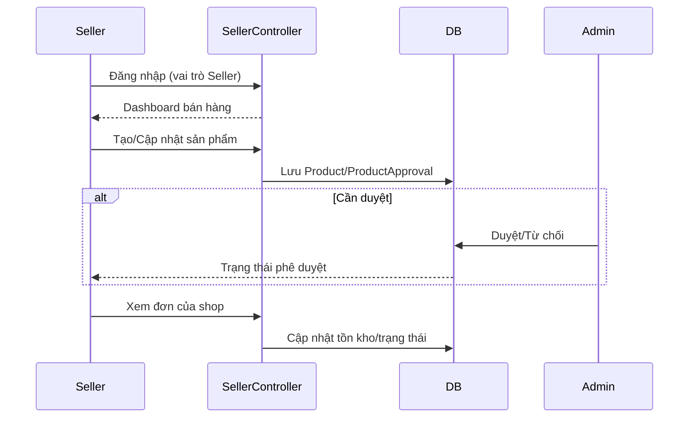
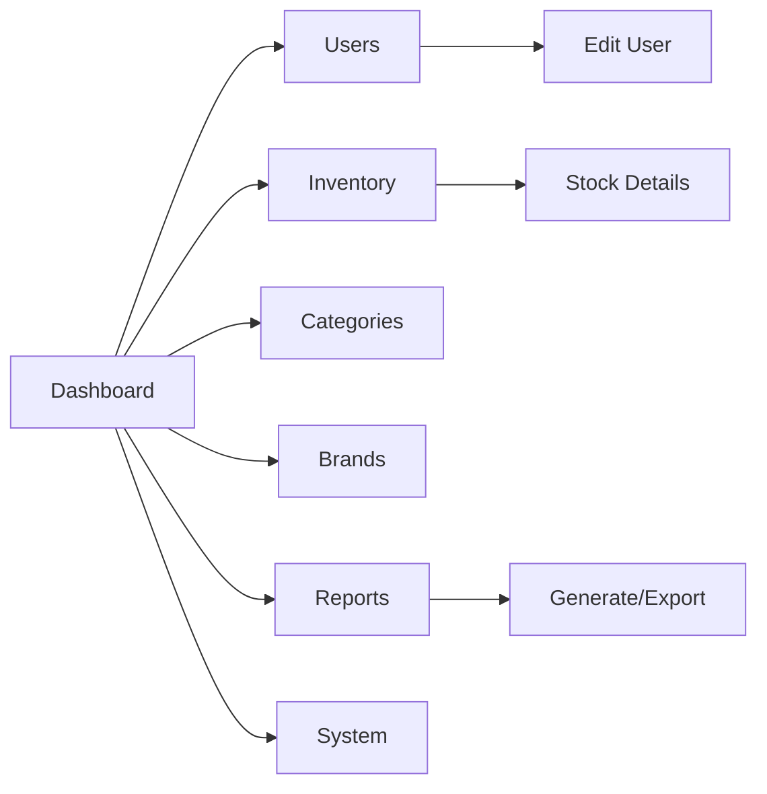
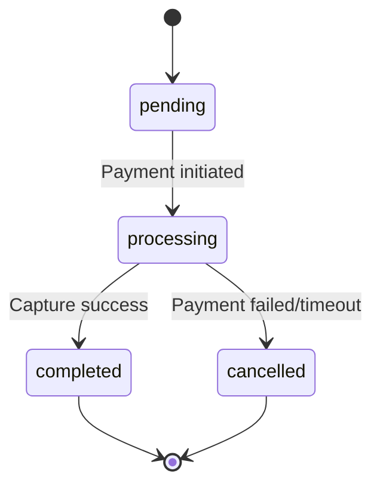
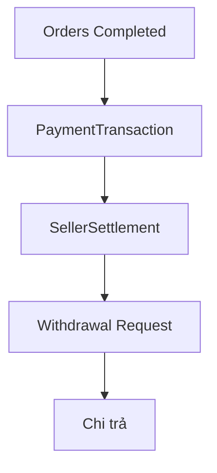

# Báo cáo Pipelines: Admin, User, Seller, Hệ thống & Thanh toán

Phiên bản: 2025-10-24

Tài liệu này mô tả chi tiết các pipeline (quy trình) nghiệp vụ và kỹ thuật trong hệ thống John Henry Fashion Web, bao gồm pipeline của Admin, User (Khách hàng), Seller, hệ thống (khởi động, bảo mật, cache, logging) và pipeline thanh toán.

---

## 1. Pipeline tổng thể hệ thống

### 1.1 Khởi động ứng dụng

1) Nạp biến môi trường từ `.env`
2) Thiết lập cấu hình (ConnectionStrings, JWT, Google, Email, SiteSettings, PaymentGateways, Security...)
3) Đăng ký dịch vụ: DbContext(PostgreSQL), Identity, Auth (Cookie/JWT/Google), Cache (Memory/Redis), Session, Services*, HttpClient, Swagger, ApplicationInsights, ResponseCaching/Compression
4) Build app và seeding:
   - `SeedAdminSystemDataAsync()` (SeedDataService)
   - Đảm bảo DB tạo (`EnsureCreated`), seed roles (Admin/Seller/Customer), seed user Admin/Seller mặc định, seed BlogPosts mẫu
   - Seed phương thức giao hàng (Scripts/SeedShippingMethods)
5) Cấu hình middleware pipeline (Dev/Prod khác nhau)
6) Map routes (Blog, Default, API)

Sơ đồ khởi động:

### 1.2 Bảo mật & tuân thủ

- Chính sách mật khẩu, lockout, xác thực email/2FA, cookie policy
- Security headers (prod), HTTPS, SameSite, HttpOnly, session trước auth
- Audit/SecurityLog cho hành vi bảo mật quan trọng

---

## 2. Pipeline User (Khách hàng)

### 2.1 Đăng ký/Đăng nhập

1) Register: tạo tài khoản, tùy chọn xác thực email bằng mã 6 số (lưu cache Redis 10 phút), thêm role Customer
2) Login: kiểm tra khóa tài khoản, xác thực mật khẩu; luồng 2FA; ghi nhận login attempt; cập nhật LastLoginDate
3) Google OAuth: tạo user nếu chưa có, auto confirm email, liên kết login provider

### 2.2 Quản lý tài khoản

- Hồ sơ cá nhân, đổi/đặt mật khẩu, 2FA (EnableAuthenticator, recovery codes), quản lý địa chỉ mặc định, bảng điều khiển bảo mật (versions, sessions, logs)

### 2.3 Mua sắm

- Xem chi tiết sản phẩm, gợi ý sản phẩm liên quan
- Thêm vào giỏ / cập nhật / xóa; “Buy Now” sang Checkout nhanh
- Checkout tạo `CheckoutSession` (items, phí ship, thuế, giảm giá) -> chọn thanh toán -> tạo `Order` -> chuyển gateway hoặc COD
- Nhận email xác nhận, thông báo; xem lịch sử đơn hàng

Sơ đồ pipeline mua sắm:

---

## 3. Pipeline Seller (Người bán)

Mục tiêu: Người bán quản lý sản phẩm, tồn kho, đơn hàng thuộc cửa hàng của họ; gửi sản phẩm chờ duyệt (ProductApproval) khi bật chế độ kiểm duyệt.

Các khối chính (hiện diện qua dữ liệu và controller Seller*):
- Dashboard Seller: thống kê đơn/bán hàng của chính seller
- Quản lý sản phẩm: thêm/sửa/xóa, hình ảnh, SKU, tồn kho, giá; lịch sử phê duyệt
- Đơn hàng của seller: tiến trình xử lý, cập nhật trạng thái giao hàng (nếu mô hình đa-seller)
- Quyết toán (SellerSettlement), yêu cầu rút tiền (WithdrawalRequest)

Pipeline điển hình (giản lược):

---

## 4. Pipeline Admin

Chức năng chính (từ `AdminController` và các phần mở rộng):
- Dashboard: KPI doanh thu, đơn, khách, cảnh báo đơn chờ xử lý; order gần đây; user mới; so sánh tuần; biểu đồ
- Quản trị sản phẩm: Inventory (lọc low/out/in-stock), danh mục, thương hiệu, review, coupon
- Quản trị người dùng: tìm kiếm, phân trang, bật/tắt, phân quyền, reset mật khẩu, xem chi tiết, thống kê
- Báo cáo: Sinh báo cáo Excel/PDF, lịch chạy định kỳ; analytics real-time, chart dữ liệu, export
- Hệ thống: nhật ký, backup (khung), bảo mật, cấu hình nền tảng/thuế/ship/email/gateway (ở tầng model)

Sơ đồ điều hướng admin (khái quát):

---

## 5. Pipeline Thanh toán chi tiết

### 5.1 Thành phần

- `CheckoutController` + `PaymentService`
- Gateways: VNPay, MoMo, Stripe (cấu hình khóa/URL/secret qua env), COD, Bank Transfer
- Bảng dữ liệu tham gia: CheckoutSession(+Items), Order(+Items), Payment/PaymentAttempt/PaymentTransaction, OrderStatusHistory, Promotion, ShippingMethod

### 5.2 Quy trình chuẩn

1) Tạo phiên checkout từ giỏ hoặc Buy Now
2) Tính phí ship (ShippingMethod), thuế (VAT 10%), giảm giá (Promotion/Coupon), tổng tiền
3) Người dùng chọn phương thức thanh toán
4) Tạo Order (pending), đánh dấu session `processing`
5) Gọi PaymentService.ProcessPaymentAsync:
   - Nếu gateway online: nhận PaymentUrl và redirect
   - Nếu COD/Bank: trả kết quả trực tiếp (pending) và chuyển trang thành công
6) Xử lý return/notify: xác minh và gọi CompleteOrder
7) CompleteOrder: `paid`/`processing`, gửi email/notification, trừ tồn kho, ghi lịch sử

### 5.3 Biểu đồ trạng thái Order/Payment

### 5.4 Kiểm soát lỗi & ngoại lệ

- Hết phiên checkout (ExpiresAt)
- Lỗi gateway/timeout -> set `failed/cancelled` và báo người dùng
- Kiểm tra tồn kho trước/ sau thanh toán; tự động đánh dấu `out_of_stock` nếu hết hàng
- Bảo vệ webhook (khuyến nghị): xác minh chữ ký/secret; idempotency xử lý notify

---

## 6. Pipeline Hệ thống bổ trợ

### 6.1 Caching & Hiệu năng

- ResponseCaching filter toàn cục (Duration=300, vary-by User-Agent)
- ResponseCompression: Brotli/Gzip
- StaticFiles: Cache-Control 1 năm
- Redis cache cho dữ liệu tạm/phiên bản nhẹ (ví dụ mã xác thực email)

### 6.2 Logging & Giám sát

- Serilog: Console + File rolling ngày `logs/john-henry-.txt`
- Application Insights: cấu hình qua ConnectionString

### 6.3 Bảo mật hệ thống

- Security headers (prod), HSTS, HTTPS
- Identity lockout, 2FA, email confirmation, mật khẩu mạnh
- SecurityLog/ActiveSession để audit

---

## 7. Pipeline dữ liệu quản trị tài chính (Seller/Settlement)

- `PaymentTransaction`: bút toán theo đơn/seller
- `SellerSettlement`: quyết toán cho seller, số quyết toán unique, trạng thái, người duyệt
- `WithdrawalRequest`: yêu cầu rút tiền, trạng thái luồng duyệt

Pipeline (khái quát):

---

## 8. Rủi ro & điểm cần hoàn thiện

- PaymentService: cần tích hợp thực tế (chữ ký/endpoint) cho VNPay/MoMo/Stripe
- Bảo vệ PaymentNotify: xác minh chữ ký, idempotency key
- Test coverage: chưa có test tự động; đề xuất thêm unit/integration test cho checkout, coupon, inventory
- Rate limiting/anti-automation cho login/checkout/payment
- Quản trị Seller đầy đủ UI/flow duyệt sản phẩm

---

## 9. Phụ lục: Tham chiếu các controller chính

- AccountController: Login/Register/2FA/Profile/Addresses/Security/OAuth
- ProductsController: ProductDetail, AddToCart, BuyNow
- CartController: Index, UpdateQuantity, RemoveItem, ClearCart, SaveSelectedItems, Sidebar
- CheckoutController: Index, CreateSession, Payment, ProcessPayment, Success/Failed, PaymentReturn/Notify
- PaymentController: Flow demo VNPay/MoMo/COD/Bank (để tham khảo)
- AdminController (+ *.Blog/*.Orders/*.Settings): Dashboard/Users/Inventory/Reports/Categories/Brands/Coupons/Reviews
- SellerController (+ SellerProductsController): Dashboard/Quản lý theo Seller

---

Tài liệu này được tối ưu để xuất sang Word/PDF. Khi xuất, có thể thêm bảng biểu/screenshot dashboard, biểu đồ doanh thu, và log mẫu để đạt mức chi tiết theo yêu cầu ban lãnh đạo/đối tác.
